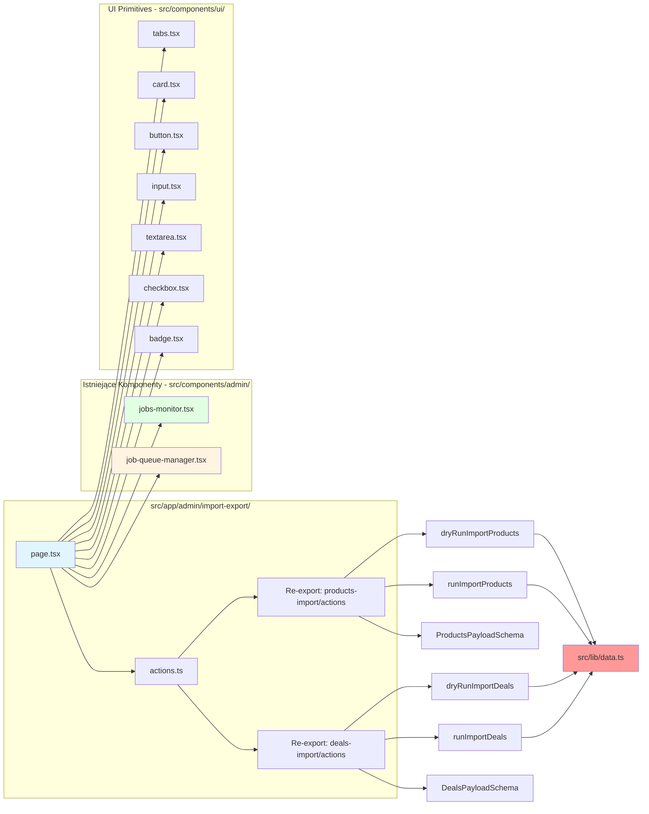
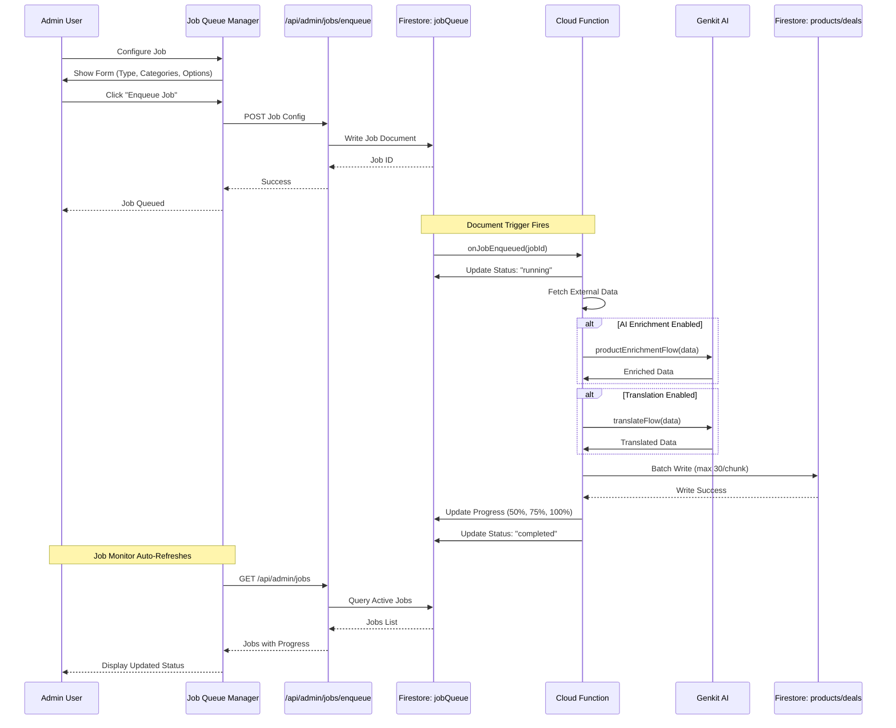
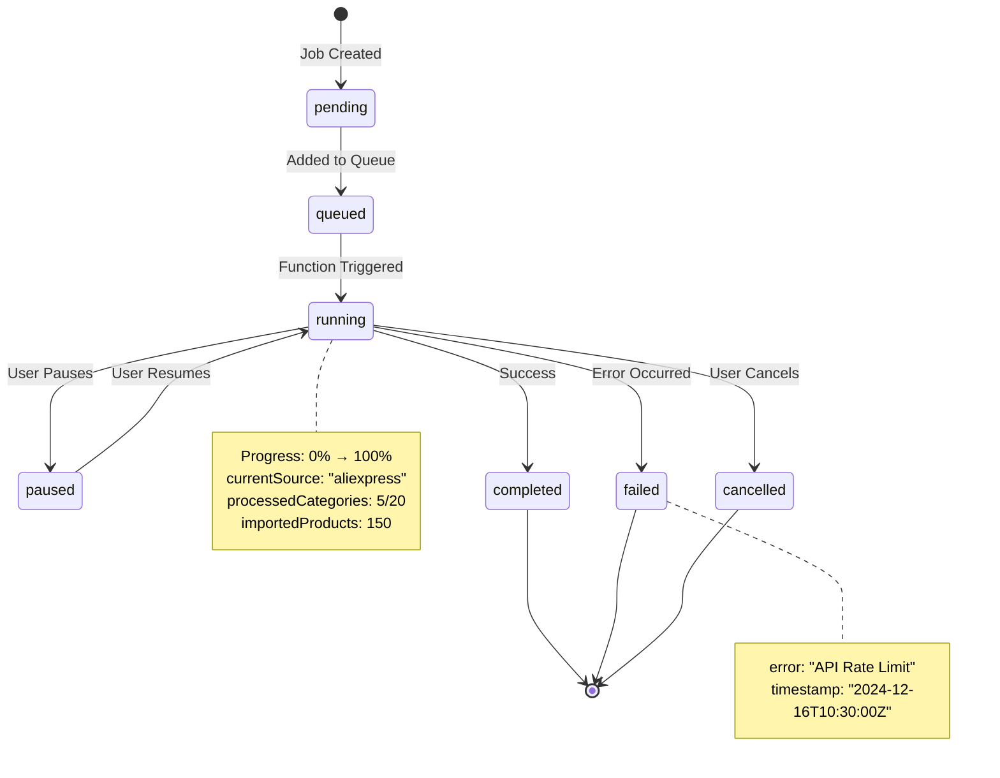
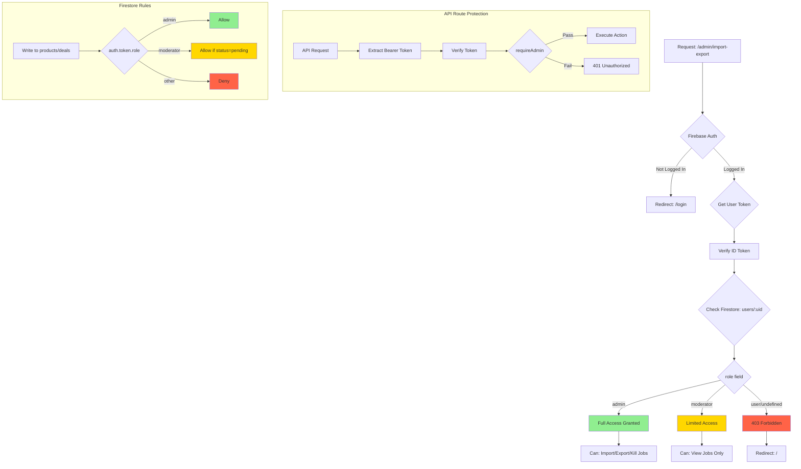
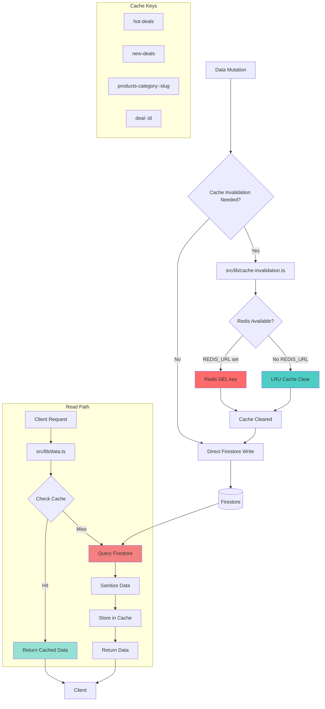

# Architektura Systemu Import/Export - Okazje Plus

## Diagram Główny - Przepływ Danych

```mermaid
graph TB
    subgraph "Frontend - Unified Console"
        A[Użytkownik Admin] --> B[/admin/import-export]
        B --> C{Wybór Tab}
        C -->|Tab 1| D[Import JSON]
        C -->|Tab 2| E[Job Monitor]
        C -->|Tab 3| F[Job Queue Manager]
    end

    subgraph "Tab 1 - Import JSON Flow"
        D --> G[Wybór Typu]
        G -->|Okazje| H[Config: Okazje]
        G -->|Produkty| I[Config: Produkty]
        H --> J[Status Filter]
        I --> J
        J -->|Gotowe| K[Approved Only]
        J -->|Drafty| L[Drafts Only]
        J -->|Wszystko| M[All Status]
        K --> N[Processing Options]
        L --> N
        M --> N
        N --> O{Tryb}
        O -->|Dry-run| P[Analiza bez zapisu]
        O -->|Import| Q[Zapis do Firestore]
    end

    subgraph "API Layer"
        P --> R[/api/admin-import/products]
        P --> S[/api/admin-import/deals]
        Q --> R
        Q --> S
        R --> T[Server Action: dryRunImportProducts]
        R --> U[Server Action: runImportProducts]
        S --> V[Server Action: dryRunImportDeals]
        S --> W[Server Action: runImportDeals]
    end

    subgraph "Data Layer - src/lib/data.ts"
        T --> X[Validation: ProductsPayloadSchema]
        U --> X
        V --> Y[Validation: DealsPayloadSchema]
        W --> Y
        X --> Z[Sanitize Data]
        Y --> Z
        Z --> AA{Check Duplicates}
        AA -->|Dedupe ON| AB[Filter Duplicates]
        AA -->|Dedupe OFF| AC[Keep All]
        AB --> AD[Batch Operations]
        AC --> AD
        AD --> AE[chunkArray: max 30 items]
    end

    subgraph "Firestore Operations"
        AE --> AF{Upsert?}
        AF -->|True| AG[getDoc → setDoc/updateDoc]
        AF -->|False| AH[Only New: addDoc]
        AG --> AI[(Firestore: products)]
        AG --> AJ[(Firestore: deals)]
        AH --> AI
        AH --> AJ
    end

    subgraph "Cache Invalidation"
        AI --> AK[invalidateProductsCache]
        AJ --> AL[invalidateHotDealsCache]
        AK --> AM{Redis Available?}
        AL --> AM
        AM -->|Yes| AN[Redis Cache Clear]
        AM -->|No| AO[LRU Cache Clear]
    end

    subgraph "Tab 2 - Job Monitor Flow"
        E --> AP[Fetch: /api/admin/jobs]
        AP --> AQ[Display Active Jobs]
        AQ --> AR{User Action}
        AR -->|Start| AS[PUT: /api/admin/jobs/:id/start]
        AR -->|Pause| AT[PUT: /api/admin/jobs/:id/pause]
        AR -->|Cancel| AU[PUT: /api/admin/jobs/:id/cancel]
        AR -->|Kill All| AV[DELETE: /api/admin/jobs/kill-all]
        AS --> AW[Update Job Status]
        AT --> AW
        AU --> AW
        AV --> AW
        AW --> AX[(Firestore: importJobs)]
    end

    subgraph "Tab 3 - Job Queue Flow"
        F --> AY[Job Type Selection]
        AY --> AZ[Job Type Dropdown]
        AZ -->|import_aliexpress| BA[Config: AliExpress]
        AZ -->|import_allegro| BB[Config: Allegro]
        AZ -->|import_amazon| BC[Config: Amazon]
        AZ -->|verify_links| BD[Config: Verification]
        BA --> BE[Category Config]
        BB --> BE
        BC --> BE
        BD --> BE
        BE --> BF[Items per Category]
        BF --> BG[Draft Status Option]
        BG --> BH[POST: /api/admin/jobs/enqueue]
        BH --> BI[(Firestore: jobQueue)]
    end

    subgraph "Cloud Functions - okazje-plus/"
        BI --> BJ[onJobEnqueued Trigger]
        BJ --> BK[Process Job]
        BK --> BL{Job Type}
        BL -->|import_*| BM[Fetch External API]
        BL -->|verify_links| BN[Check URL Status]
        BL -->|cleanup| BO[Remove Invalid Data]
        BM --> BP[AI Enrichment?]
        BP -->|Yes| BQ[Genkit Flow: Product Enrichment]
        BP -->|No| BR[Skip Enrichment]
        BQ --> BS[Translation?]
        BR --> BS
        BS -->|Yes| BT[Genkit Flow: Translation]
        BS -->|No| BU[Skip Translation]
        BT --> BV[Write to Firestore]
        BU --> BV
        BV --> AI
        BV --> AJ
        BV --> BW[Update Job Progress]
        BW --> AX
    end

    subgraph "Genkit AI Flows - src/ai/flows/"
        BQ --> BX[genkit.ts Entry Point]
        BT --> BX
        BX --> BY{Flow Type}
        BY -->|Enrichment| BZ[flows/enrichment/productEnrichmentFlow]
        BY -->|Translation| CA[flows/translation/translateFlow]
        BZ --> CB[Vertex AI: Gemini 2.0 Flash]
        CA --> CB
        CB --> CC[Structured Output]
        CC --> CD[Return to Function]
    end

    subgraph "Authentication & Security"
        A --> CE[Firebase Auth]
        CE --> CF{Check Role}
        CF -->|admin| CG[Full Access]
        CF -->|moderator| CH[Limited Access]
        CF -->|user| CI[Denied]
        CG --> D
        CG --> E
        CG --> F
        CH --> E
        CI --> CJ[Redirect to Login]
    end

    subgraph "Session Management - Tab 1"
        N --> CK[createSession]
        CK --> CL[Generate Session ID]
        CL --> CM[Initial Log: Start Time]
        P --> CN[addLog: Dry-run Started]
        Q --> CO[addLog: Import Started]
        CN --> CP[Timestamped Log Entry]
        CO --> CP
        CP --> CQ[Display in History Card]
        CQ --> CR{Session Complete?}
        CR -->|Yes| CS[Show Statistics]
        CR -->|Error| CT[Show Error Details]
        CS --> CU[Total/Created/Updated/Duplicates]
    end

    style B fill:#e1f5ff
    style D fill:#ffe1e1
    style E fill:#e1ffe1
    style F fill:#fff3e1
    style AI fill:#ff9999
    style AJ fill:#ff9999
    style AX fill:#ff9999
    style BI fill:#ff9999
    style CB fill:#9999ff
    style CE fill:#ffcc99
```

## Diagram Komponentów - Integracje



## Diagram Przepływu Zadań (Job Flow)



## Diagram Stanów Zadań (Job State Machine)



## Diagram Bezpieczeństwa (Security Flow)



## Diagram Cache (Caching Strategy)



## Kluczowe Informacje

### 1. Typy Danych
- **Okazje (Deals)**: Tymczasowe promocje z datą wygaśnięcia
- **Produkty (Products)**: Stałe produkty w katalogu
- **Status**: `draft` → `pending` → `approved` → `rejected`

### 2. Opcje Przetwarzania
| Opcja | Okazje | Produkty | Opis |
|-------|--------|----------|------|
| Upsert | ✅ | ✅ | Aktualizuj istniejące lub utwórz nowe |
| Dedupe | ✅ | ✅ | Usuń duplikaty na podstawie URL/SKU |
| Enrichment | ❌ | ✅ | AI wzbogacenie danych (Genkit) |
| Translation | ✅ | ✅ | Tłumaczenie wielojęzyczne |
| Auto-approve | ✅ | ❌ | Automatyczna akceptacja okazji |

### 3. Limity Systemowe
- **Firestore `in` query**: Max 30 elementów (używamy `chunkArray()`)
- **Batch size**: Domyślnie 500, konfigurowalny
- **Job polling**: Co 5 sekund w Job Monitor
- **Session logs**: Max 100 wpisów per sesja

### 4. Endpoints API
```
POST   /api/admin-import/products  - Import produktów
POST   /api/admin-import/deals     - Import okazji
GET    /api/admin/jobs             - Lista zadań
PUT    /api/admin/jobs/:id/start   - Start zadania
PUT    /api/admin/jobs/:id/pause   - Pauza zadania
PUT    /api/admin/jobs/:id/cancel  - Anuluj zadanie
DELETE /api/admin/jobs/kill-all    - Zabij wszystkie zadania
POST   /api/admin/jobs/enqueue     - Dodaj do kolejki
```

### 5. Typy Zadań
1. `import_aliexpress` - Import z AliExpress API
2. `import_allegro` - Import z Allegro API
3. `import_amazon` - Import z Amazon PA-API
4. `import_ebay` - Import z eBay API
5. `verify_links` - Weryfikacja poprawności linków
6. `cleanup_products` - Czyszczenie nieaktywnych produktów
7. `repair_indexes` - Naprawa indeksów Firestore

### 6. Przepływ Danych - Krok po Kroku

#### Import JSON (Tab 1):
```
1. User: Wybór typu (Okazje/Produkty)
2. User: Wybór statusu (Gotowe/Drafty/Wszystko)
3. User: Konfiguracja opcji (Enrichment, Translation, Dedupe)
4. User: Wklejenie JSON lub użycie Sample JSON
5. User: Klik "Dry-run" → Analiza bez zapisu
6. System: Walidacja (Zod Schema)
7. System: Check duplikatów
8. System: Zwraca statystyki (total, to create, to update, duplicates)
9. User: Jeśli OK → Klik "Import"
10. System: Batch write do Firestore (chunks po 30)
11. System: Invalidacja cache (Redis/LRU)
12. System: Zwraca wynik z logami
```

#### Job Monitor (Tab 2):
```
1. System: Auto-polling co 5s → GET /api/admin/jobs
2. User: Widzi listę aktywnych zadań
3. User: Klika Start/Pause/Cancel
4. System: PUT /api/admin/jobs/:id/{action}
5. System: Cloud Function aktualizuje status
6. System: Progress bar odświeża się (0% → 100%)
7. User: Widzi szczegóły (currentSource, processedCategories, errors)
8. User: Opcjonalnie "Kill All" → kasuje wszystkie zadania
```

#### Job Queue (Tab 3):
```
1. User: Wybór typu zadania (dropdown)
2. User: Konfiguracja kategorii (main/sub/subsub)
3. User: Ustawienie limitu (items per category)
4. User: Opcja "Draft Status"
5. User: Klik "Enqueue Job"
6. System: POST /api/admin/jobs/enqueue
7. System: Zapis do Firestore: jobQueue collection
8. Cloud Function: Trigger onJobEnqueued
9. Function: Fetch external API (AliExpress/Allegro/etc.)
10. Function: AI Enrichment (jeśli enabled)
11. Function: Translation (jeśli enabled)
12. Function: Batch write do Firestore
13. Function: Update job status (running → completed)
14. Job Monitor: Auto-refresh pokazuje postęp
```

## Bezpieczeństwo

### Server-side Auth Check:
```typescript
// src/lib/auth-server.ts
export async function requireAdmin(request: Request) {
  const token = request.headers.get('Authorization')?.split('Bearer ')[1];
  if (!token) throw new Error('No token');
  
  const decodedToken = await admin.auth().verifyIdToken(token);
  const userDoc = await admin.firestore().collection('users').doc(decodedToken.uid).get();
  
  if (userDoc.data()?.role !== 'admin') {
    throw new Error('Forbidden');
  }
  
  return decodedToken;
}
```

### Firestore Rules:
```
match /products/{productId} {
  allow write: if request.auth != null && 
    (request.auth.token.role == 'admin' || 
     (request.auth.token.role == 'moderator' && request.resource.data.status == 'pending'));
}

match /deals/{dealId} {
  allow write: if request.auth != null && 
    (request.auth.token.role == 'admin' || request.auth.token.role == 'moderator');
}
```

## Optymalizacje

### 1. Batch Operations
- Firestore ma limit 10 `in` queries jednocześnie
- Używamy `chunkArray(array, 30)` do dzielenia na porcje
- Każda porcja to osobny batch write

### 2. Cache Strategy
- **Hot Deals**: TTL 5 minut (często się zmienia temperatura)
- **Products by Category**: TTL 15 minut
- **Deal Details**: TTL 30 minut
- Invalidacja natychmiastowa po mutacji

### 3. Job Monitoring
- Polling co 5s (nie realtime - redukcja kosztów)
- Frontend filtruje tylko aktywne zadania (status !== 'completed')
- Kill All kasuje tylko lokalne zadania, nie wpływa na Cloud Functions

## Troubleshooting

### Problem: "Zadanie się nie uruchamia"
**Diagnoza:**
1. Check Firestore: `jobQueue` collection → verify document created
2. Check Cloud Functions logs: `firebase functions:log`
3. Verify trigger function deployed: `onJobEnqueued`

### Problem: "Import się zawiesza na 50%"
**Diagnoza:**
1. Check session logs in Tab 1 history
2. Verify batch size (może być za duży → timeout)
3. Check external API rate limits (AliExpress/Allegro)

### Problem: "Duplikaty pomimo Dedupe=true"
**Diagnoza:**
1. Verify URL/SKU normalization logic
2. Check `data.ts` → dedupe implementation
3. Może być case-sensitivity issue

### Problem: "Cache nie się invaliduje"
**Diagnoza:**
1. Check `REDIS_URL` env var (jeśli Redis)
2. Verify `cache-invalidation.ts` wywołane po write
3. Check TTL settings w `data.ts`

## Deployment

### Local Development:
```bash
npm run dev              # Next.js dev server (:9002)
npm run genkit:dev       # Genkit UI (:4000)
```

### Production Deployment:
```bash
npm run build            # Build Next.js
npm run deploy:hosting   # Deploy to Firebase App Hosting
npm run deploy:functions # Deploy Cloud Functions
npm run deploy:prod      # Deploy ALL
```

### Post-Deployment Verification:
1. Navigate to https://okazjeplus.pl/admin/import-export
2. Hard refresh (Ctrl+Shift+R)
3. Test Tab 1: Import sample JSON (Dry-run)
4. Test Tab 2: Verify job monitor loads
5. Test Tab 3: Create test job (verify_links with 1 item)
6. Check browser console: No React errors
7. Check Firestore: Verify writes succeeded

## Changelog

**2024-12-16 - Milestone M6: Unified Console**
- Created `/admin/import-export` unified interface
- Integrated `JobsMonitor` and `JobQueueManager` components
- Added 3-tab structure (Import JSON, Job Monitor, Job Queue)
- Implemented session history with timestamped logs
- Added type selection (Okazje/Produkty)
- Added status filtering (Gotowe/Drafty/Wszystko)
- Added processing options per type
- Fixed React #418/#310 errors in `DealComparisonTool`

**Previous Milestones:**
- M5: Notifications + Price Alerts
- M4: Product Import System
- M3: Deals Import System
- M2: Admin Panel Foundation
- M1: Basic Platform Setup
